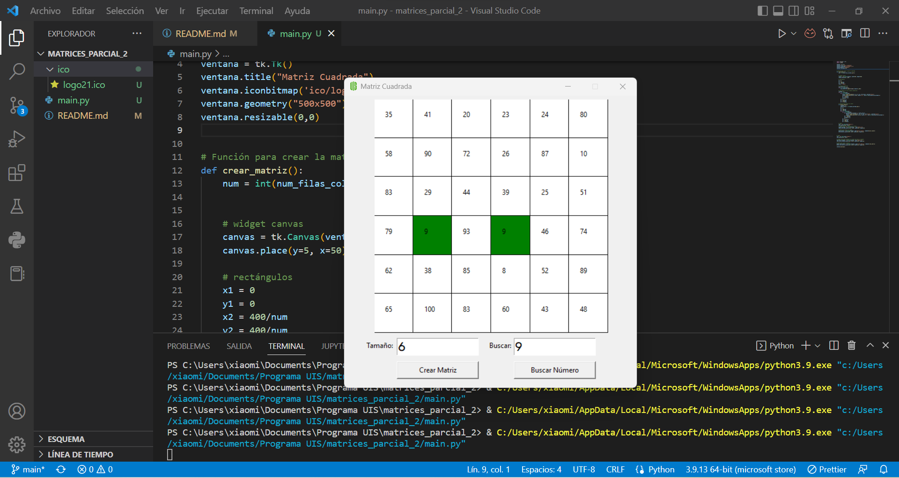

# matrices_parcial_2

Diseñar e implementar una app con Python usando la libreria tkinter, que permita resolver el siguiente problema:
Crear un programa que capture un número entero que corresponde al número de filas y columnas de una matriz cuadrada. Los elementos de esta matriz son números enteros aleatorios, en un rango determinado. La matriz es representada graficamente, mediante la clase Canvas de Tkinter, a través de un arreglo de rectángulos, de un determinado color, dentro de cada uno  del cual está un elemnto de la matriz. La funcionalidad principal del programa es buscar un número dentro de la matriz e indicarlo gráficamente poniendo el color del respectivo rectángulo en color verde.

